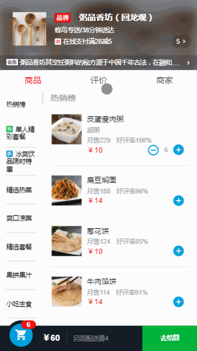
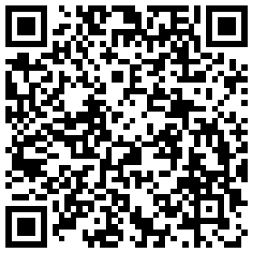

SPA-Takeaway
=========
>这是一个仿饿了么用户端的移动web app [感谢慕课](http://coding.imooc.com/class/74.html)

主要依赖
=========
个人实现从Vue1.0到2.0的升级
 + 基于vue2.0
 + 使用vue-cli全家桶脚手架
 + 使用vue-router 实现页面路由
 + 使用axios 进行http 请求获取数据
 + 使用eslint 进行js代码的规范
 + 编写mock 假数据存储在本地
 + 使用stylus 预处理器编写样式
 + 使用better-scroll 进行联动滑动

项目展示
=========


在线预览
=========
[点击此处在线预览](https://chanxw.github.io/SPA-Takeaway/index.html#/goods)
PC端可以进入调试模式使用手机模式查看，移动端可以扫描以下二维码进行查看


项目运行及编译
=========
```
# clone the repo into your disk.
$ git clone https://github.com/CHANxw/SPA-Takeaway.git

# install dependencies
$ npm install

# serve with hot reload at localhost:8088
$ npm run dev

# build for production with minification
$ npm run build
```

在项目中学习积累的一点小技巧和问题--可能只有自己才能理解的总结哈哈 from [简书](http://www.jianshu.com/p/3c2a0bc0352a)

关于个人
--------
[简书](http://www.jianshu.com/u/e73691f972bb) + [github](https://github.com/CHANxw) + [邮箱: wb_cxw@163.com](http://mail.163.com/)
